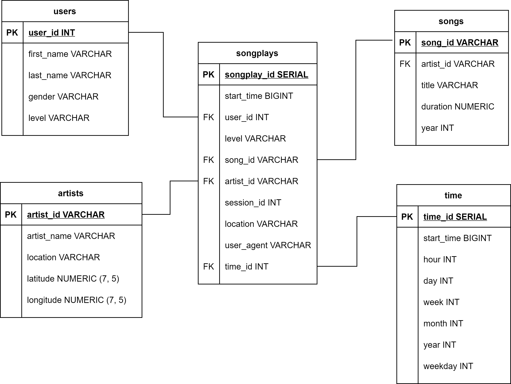

# 1. Objective
The project is to build data models for data analytic team to perform user activity analysis, where the data resides in two directories in form of JSON files.

# 2. Data Model
## 2.1 Database Schema 

The database is based on PostgreSQL and star schema is designed to optimize the queries on user activity analysis.

The fact table contains several forein keys constraints that reference primary keys in dimension tables. The ER diagram diagram below shows the star schema.

## 2.2 Implement ELT 
- `sql_queries.py` contains the queries with data quality check (create, drop, insert, select) used in this project.
- `create_tables.py` initialize the database and create (drop) tables
- `etl.py` data manipulation with high efficient multiple records insertions (copy_from, extras.execute_values).

# 3. Usage
Run code from command line:

    python create_tables.py
    python sql_queries.py

